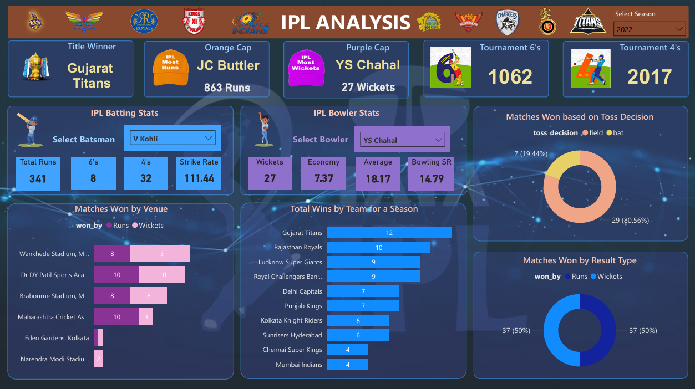

# IPL Analysis Power BI Dashboard

An end-to-end IPL data analysis project (2008–2022) using Power BI. Raw data stored in PostgreSQL; data cleaning, transformation, and modeling done in Power BI. The dashboard reveals insights on team wins, player stats, toss decisions, match outcomes, and season highlights.

