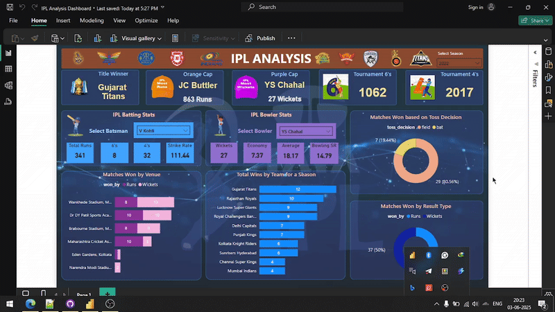

# IPL Analysis Power BI Dashboard

An end-to-end IPL data analysis project (2008–2022) using Power BI. Raw data stored in PostgreSQL; data cleaning, transformation, and modeling done in Power BI. The dashboard reveals insights on team wins, player stats, toss decisions, match outcomes, and season highlights.

🎥 **Live Demo: IPL Dashboard in Action**  



---

**Screenshot of Dashboard**


---

## 📝 Project Summary

This project involves developing an interactive and visually engaging Power BI dashboard to analyze the Indian Premier League (IPL) cricket data. The dashboard provides comprehensive insights into team performances, player statistics, match outcomes, and historical trends. It empowers cricket analysts, fans, and stakeholders to explore data-driven insights, make informed decisions, and understand the dynamics of the IPL season-by-season.

---

## 📌 Objective 

The goal of this project is to build a dynamic and interactive dashboard using Power BI that provides meaningful insights into team performances, player statistics, match outcomes, and historical trends based on Indian Premier League (IPL) cricket data.

---

## 🛠️ Tools & Technologies

- Power BI Desktop: For designing and building the interactive IPL dashboard.
- DAX (Data Analysis Expressions): For creating custom measures and calculations to analyze player and team statistics.
- Power Query: For data cleaning, transformation, and shaping IPL match and player data.
- PostgreSQL: For storing and managing IPL datasets, enabling efficient querying and data retrieval.
- CSV/Excel Files: As the primary data sources containing match results, player stats, and team details.

---

## 📊 Dashboard Features

- **Overall Tournament KPIs**:  
  - Title Winner (Champion Team)  
  - Orange Cap Holder (Top Run-Scorer)  
  - Purple Cap Holder (Top Wicket-Taker)  
  - Total Sixes Hit in the Tournament  
  - Total Fours Hit in the Tournament  

- **IPL Batting Statistics KPIs**:  
  - Total Runs Scored  
  - Number of Sixes  
  - Number of Fours  
  - Batting Strike Rate  

- **IPL Bowling Statistics KPIs**:  
  - Total Wickets Taken  
  - Bowling Economy Rate  
  - Bowling Average  
  - Bowling Strike Rate  

- **Analytical Charts**:  
  - Matches Won Based on Toss Decision (Batting or Fielding First)  
  - Matches Won by Result Type (Normal Win, Tie, Super Over, etc.)  
  - Matches Won by Venue (Stadium-wise Analysis)  
  - Total Wins by Each Team for a Selected Season  

- **Filters & Slicers for Interactive Analysis**:  
  - Season Selector  
  - Batsman Selector  
  - Bowler Selector  

---

## 🗂️ Project Structure

```plaintext
IPL-Analysis-Powerbi-Dashboard/
│
├── dataset/
│   ├── ipl_matches_2008_2022.csv
│   └── ipl_ball_by_ball_2008_2022.csv
│
├── database/
│   └── Queries to Create Table in PostgreSQL.txt  # SQL script to create IPL tables in PostgreSQL
│
├── dashboard/
│   └── IPL Analysis Dashboard.pbix
│
├── assets/
│   └── IPL Images/
│       └── (team logos, icons, etc.)
│
├── screenshots/
│   └── dashboard-screenshot.png
│
└── README.md
```

---

## 📁 Datasets

### 🔹 ipl_matches_2008_2022.csv  
Contains match-level data with the following columns:  
- id  
- city  
- match_date  
- season  
- match_number  
- team1  
- team2  
- venue  
- toss_winner  
- toss_decision  
- superover  
- winning_team  
- won_by  
- margin  
- method  
- player_of_match  
- umpire1  
- umpire2  

### 🔹 ipl_ball_by_ball_2008_2022.csv  
Contains ball-by-ball match details with the following columns:  
- id  
- innings  
- overs  
- ball_number  
- batter  
- bowler  
- non_striker  
- extra_type  
- batsman_run  
- extras_run  
- total_run  
- non_boundary  
- iswicket_delivery  
- player_out  
- dismisal_kind  
- fielders_involved  
- batting_team  

---

## 🚀 How to Use

1. Clone the repository:
   ```bash
   git clone https://github.com/Mandar-Tannu/IPL-Analysis-Powerbi-Dashboard.git

---

## ⚠️ Challenges Faced

- Handling missing or inconsistent data across multiple IPL seasons, requiring thorough data cleaning and validation.  
- Establishing accurate relationships between ball-by-ball data and match-level data to enable precise analysis.  
- Managing the large volume of ball-by-ball records to maintain dashboard performance and responsiveness.  
- Designing an intuitive and interactive dashboard that presents complex cricket statistics clearly for diverse users.  
- Creating dynamic filters and slicers that seamlessly update visuals across different seasons, players, and teams.

---

## 🔮 Future Improvements

- Integrate real-time data refresh capabilities to update the dashboard with ongoing IPL match data automatically.  
- Add more granular filters such as match phases (powerplay, death overs) and player-specific performance trends.  
- Implement advanced predictive analytics to forecast player performances and match outcomes using Power BI AI features.  
- Expand geographic analysis by including venue-level insights and crowd attendance statistics.  
- Incorporate additional datasets like player fitness data, weather conditions, and social media sentiment to enrich analysis.

---

## 🧠 My Learning Journey

- Gained practical experience in handling large sports datasets and transforming complex ball-by-ball and match data using Power Query.  
- Developed robust data models linking multiple IPL datasets to enable accurate and dynamic analysis.  
- Enhanced skills in DAX by creating calculated measures and KPIs relevant to cricket statistics (runs, wickets, strike rate, economy, etc.).  
- Designed interactive and user-friendly dashboards with filters and slicers for deep exploration of IPL seasons, players, and match outcomes.  

---

## 📬 Contact

Created by Mandar Tannu  
Email: mandartannu19@gmail.com  
LinkedIn: https://www.linkedin.com/in/mandartannu/
